<div align="center">

# ⚡ TaxRoutine 360

### Tax Technology • Data • Automation • Artificial Intelligence

**Transformando complexidade tributária em inteligência para decisão.**


</div>

---

# 🚀 O que é o TaxRoutine 360?

O **TaxRoutine 360** é um projeto de **Tax Technology** criado para explorar como conhecimento tributário, dados, automação, software e Inteligência Artificial podem ser combinados para apoiar decisões fiscais e empresariais.

O projeto parte de um problema comum:

> **A complexidade tributária não está apenas em calcular impostos. Está em interpretar dezenas de variáveis antes de decidir como uma operação deve ser tratada.**

Uma operação pode envolver simultaneamente:

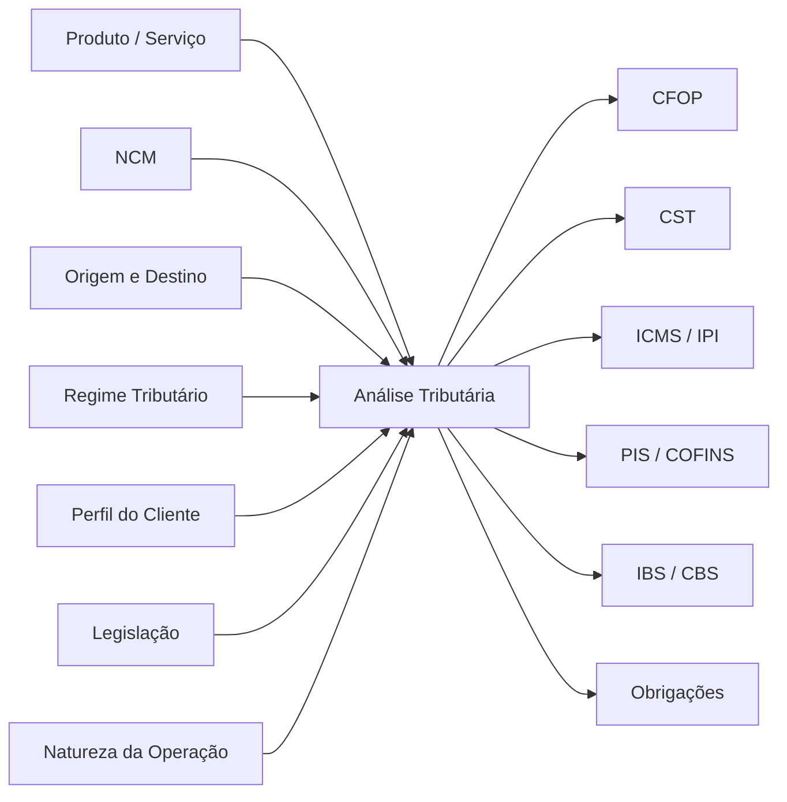

O TaxRoutine 360 procura transformar essas variáveis em **processos estruturados de análise**.

---

# 🎯 Visão do projeto

<div align="center">

### TAX + DATA + TECHNOLOGY + AI

</div>

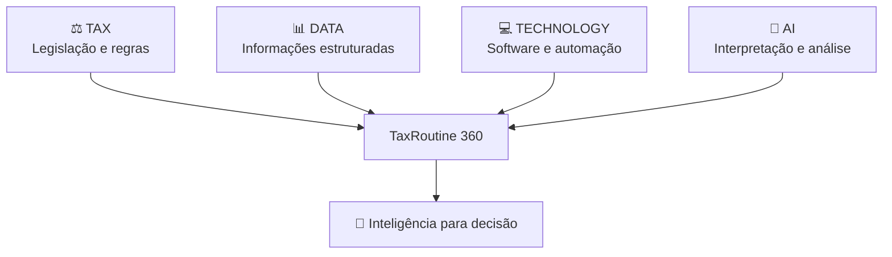

O objetivo não é simplesmente criar calculadoras.

A proposta é estudar como **conhecimento tributário pode ser convertido em lógica, software, automações e produtos digitais**.

---

# 🖥️ Conheça alguns módulos

> As telas abaixo representam algumas das experiências desenvolvidas dentro do ecossistema TaxRoutine 360.

## ⚖️ Análise Inteligente de Contratos


### IA aplicada à análise tributária e contratual

O módulo permite enviar contratos e utilizar Inteligência Artificial como apoio para identificação de questões relacionadas a:

* ISS;
* INSS;
* IRRF;
* CSRF;
* retenções;
* cláusulas tributárias;
* riscos;
* oportunidades;
* responsabilidades;
* pontos que exigem validação adicional.

### Processo


A proposta é acelerar a análise preliminar sem substituir a avaliação jurídica ou tributária especializada.

---

# 💰 Venda Inteligente 360


### Tributação antes de fechar a venda

O **Venda Inteligente 360** aproxima o departamento fiscal das decisões comerciais.

Em vez de analisar o impacto tributário somente depois da venda, o módulo permite considerar impostos durante a própria negociação.

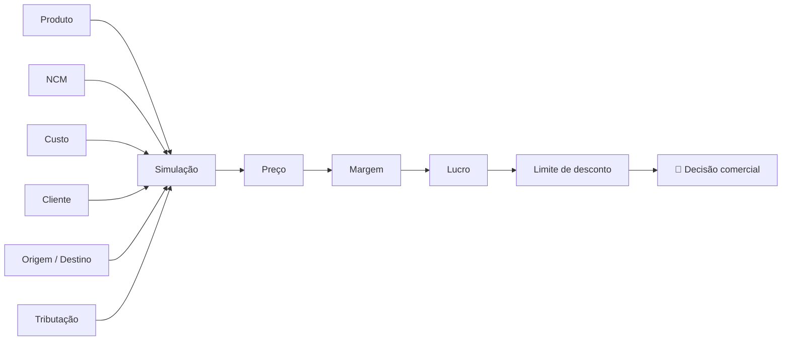

Entre os indicadores apresentados estão:

| Indicador               | Objetivo                          |
| ----------------------- | --------------------------------- |
| 💵 Preço final          | Valor proposto ao cliente         |
| 🧾 Impostos estimados   | Impacto tributário da operação    |
| 📊 Carga efetiva        | Peso dos tributos sobre a venda   |
| 📈 Margem               | Margem de contribuição            |
| 💰 Lucro                | Resultado estimado                |
| 🤝 Comissão             | Impacto da comissão comercial     |
| 🎯 Limite de negociação | Até onde o vendedor pode negociar |

> **O imposto deixa de ser apenas uma consequência da venda e passa a fazer parte da decisão comercial.**

---

# 🧾 Simulador de Operação Fiscal 360


### Transformando uma operação comercial em enquadramento fiscal

O módulo estrutura uma operação considerando diferentes variáveis.

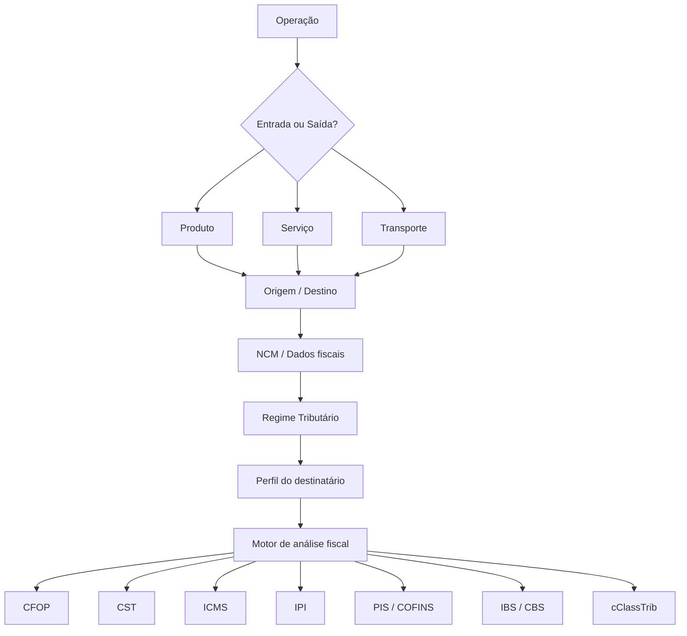

A proposta é transformar uma pergunta ampla:

> **"Como devo tributar esta operação?"**

em uma sequência estruturada de parâmetros e decisões.

---

# 🧮 Calculadora de ICMS, ICMS-ST e DIFAL


### Cálculo + legislação + obrigação

O módulo analisa diferentes elementos da tributação estadual.

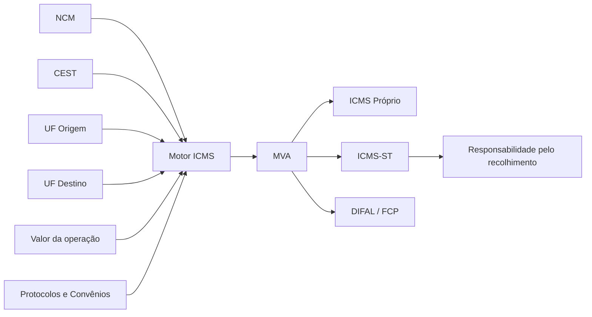

O diferencial está em não mostrar somente o valor matemático.

A análise procura relacionar:

**NCM + CEST + Origem + Destino + MVA + Protocolos + Convênios + Obrigação**

---

# 🔎 Validador de NCM


### A classificação fiscal como ponto de partida

A classificação correta da mercadoria influencia diferentes tratamentos tributários.

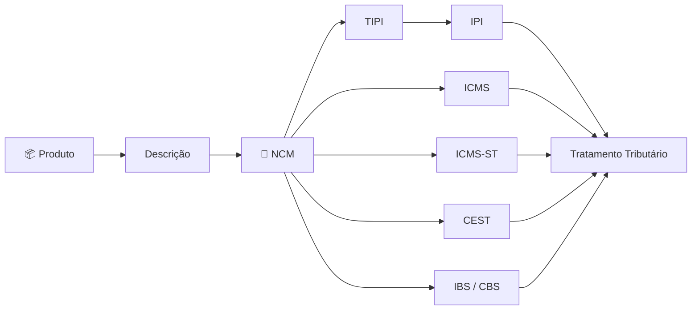

O módulo contempla diferentes formas de consulta:

* consulta individual;
* validação de NCMs em lote;
* busca inteligente;
* período da consulta;
* UF da operação;
* descrição da mercadoria;
* finalidade do produto.

---

# 🔗 Ecossistema integrado

Os módulos foram pensados como partes de uma jornada maior.


### Uma única operação pode exigir diferentes perspectivas

```text
Contrato
   ↓
Produto
   ↓
Classificação Fiscal
   ↓
Enquadramento da Operação
   ↓
Tributação
   ↓
Preço
   ↓
Margem
   ↓
Decisão
```

---

# 🧠 Como o TaxRoutine 360 pensa uma análise

A ideia central do projeto é não começar pelo imposto.

A análise começa pelo **contexto da operação**.

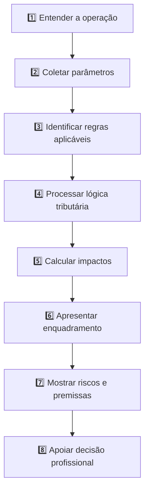

---

# 🏗️ Do conhecimento tributário para o software

Um dos objetivos centrais do projeto é transformar conhecimento fiscal em lógica computacional.


Esse processo permite estudar como decisões normalmente realizadas manualmente podem ser transformadas em:

* regras;
* condições;
* parâmetros;
* validações;
* tabelas;
* relacionamentos;
* algoritmos;
* fluxos de decisão.

---

# 🤖 Inteligência Artificial aplicada ao TAX

A Inteligência Artificial atua como uma camada complementar.

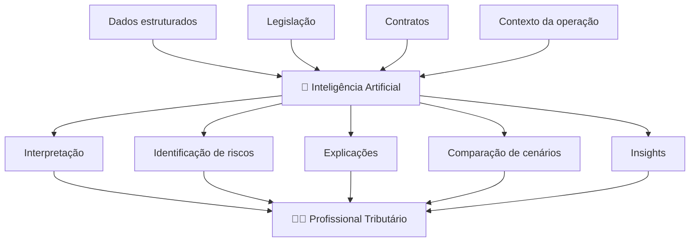

### Princípio do projeto

> **A Inteligência Artificial não substitui o conhecimento tributário. Ela amplia a capacidade de análise do profissional.**

---

# 🇧🇷 Reforma Tributária

A Reforma Tributária representa muito mais do que mudança de alíquotas.

Ela exige transformação de:

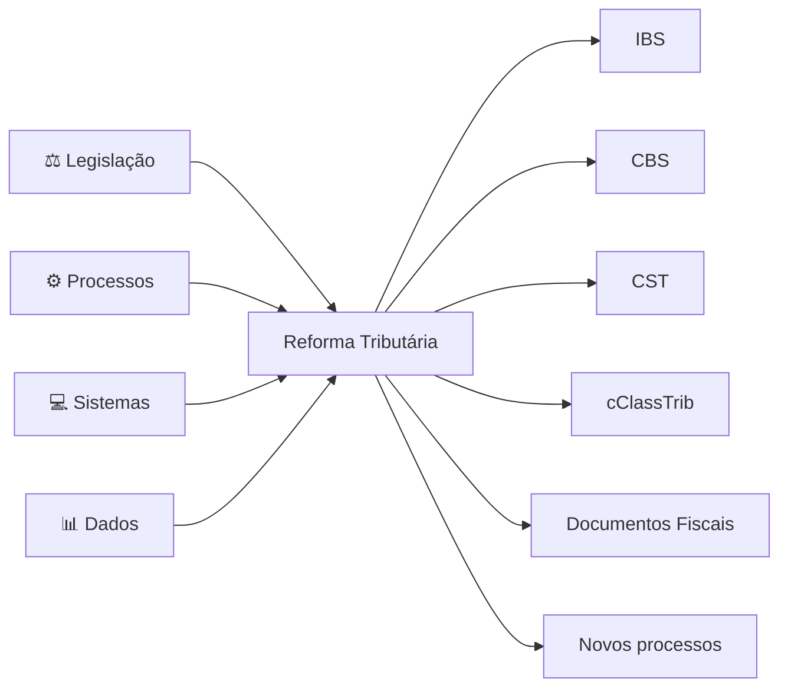

O TaxRoutine 360 também explora cenários associados à transição para o novo modelo tributário brasileiro.

---

# 🏢 TaxRoutine 360 e Tax Transformation

O projeto procura aproximar áreas que tradicionalmente trabalham separadamente.

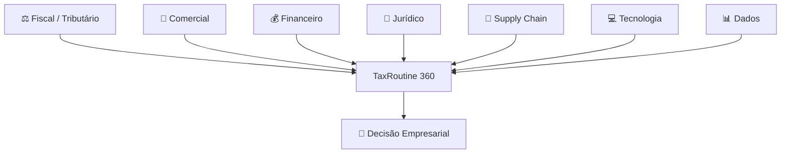

---

# 💡 Benefícios

|      | Benefício              | Impacto                                               |
| ---- | ---------------------- | ----------------------------------------------------- |
| ⚡    | **Produtividade**      | Redução de atividades repetitivas e consultas manuais |
| 🎯   | **Padronização**       | Estrutura comum para analisar operações               |
| 🔎   | **Rastreabilidade**    | Maior visibilidade das premissas utilizadas           |
| 🧠   | **Decisão**            | Informação estruturada para análise profissional      |
| 📊   | **Dados**              | Organização das variáveis fiscais                     |
| 🤖   | **IA**                 | Apoio à interpretação e análise                       |
| 🤝   | **Integração**         | Aproxima Fiscal, Comercial, Jurídico e Tecnologia     |
| 🇧🇷 | **Reforma Tributária** | Experimentação de novas regras IBS/CBS                |

---

# 📈 Resultados do projeto

O projeto já permitiu transformar diferentes conceitos tributários em experiências digitais.

### ✅ Estruturação de cenários fiscais

Criação de fluxos orientados por parâmetros para análise de operações.

### ✅ Desenvolvimento de simuladores

Possibilidade de avaliar operações antes de sua execução.

### ✅ Tributação estadual

Modelagem de análises envolvendo ICMS, ICMS-ST, DIFAL, MVA, NCM e CEST.

### ✅ Classificação fiscal

Criação de ferramentas para validação e análise de NCM.

### ✅ Inteligência Artificial

Aplicação de IA em análise documental e interpretação tributária.

### ✅ Pricing tributário

Integração entre impostos, preço, margem e negociação comercial.

### ✅ Reforma Tributária

Incorporação progressiva de conceitos relacionados a IBS, CBS, CST e cClassTrib.

### ✅ Tax Knowledge → Software

Transformação de conhecimento técnico em regras computacionais.


---

# 🔬 O projeto como laboratório de Tax Technology

O TaxRoutine 360 também funciona como um laboratório para estudar a convergência entre:

```text
                    TAX
                     │
                     ▼
              TAX TRANSFORMATION
               ▲     ▲      ▲
               │     │      │
             DATA    AI   SOFTWARE
```

A pergunta central que orienta o desenvolvimento é:

> ### Como transformar conhecimento tributário em inteligência operacional?

---

# 🛠️ Desenvolvimento

O GitHub é utilizado para registrar e organizar a evolução técnica do projeto.

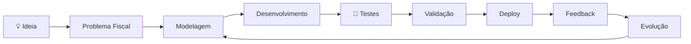

O desenvolvimento envolve atividades como:

* versionamento;
* documentação;
* experimentação;
* criação de componentes;
* implementação de regras;
* testes;
* evolução das interfaces;
* melhoria contínua.

---

# 🗺️ Roadmap

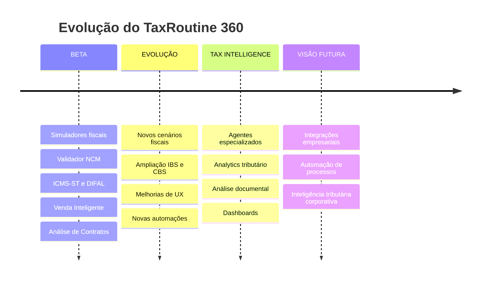

---

# 🔭 Visão

O profissional tributário continuará precisando dominar profundamente:

**legislação + processos + compliance**

Mas cada vez mais trabalhará também com:

**dados + software + automação + IA**

O TaxRoutine 360 representa uma experimentação prática dessa transformação.

---

<div align="center">

# TaxRoutine 360

### TAX + DATA + TECHNOLOGY + AI

**Da legislação à decisão.**

---

⭐ Se o projeto chamou sua atenção, deixe uma **Star** no repositório.

Sugestões e discussões sobre **Tax Technology, Reforma Tributária, automação fiscal, dados e Inteligência Artificial aplicada ao TAX** são bem-vindas.

</div>

---

# ⚠️ Disclaimer

O TaxRoutine 360 é uma ferramenta de apoio à análise.

As informações, simulações e interpretações apresentadas não substituem parecer jurídico, consultoria tributária ou validação profissional da legislação aplicável ao caso concreto.

A legislação tributária pode sofrer alterações e possuir particularidades relacionadas à empresa, operação, produto, período e jurisdição.

---

# 👨‍💻 Projeto

**TaxRoutine 360 — Tax Technology & Artificial Intelligence**

Desenvolvido como projeto de estudo, inovação e aplicação prática da integração entre **Tributação, Tecnologia, Dados e Inteligência Artificial**.
